# Laboratoire 03-B

## Objectif

Vous familiariser avec la manipulation des tableaux associatifs, des données de formulaires et des variables de session.

## Prérequis

Clonez ce dépôt à la racine du répertoire contenant les fichiers Web de votre serveur Apache. Utilisez ensuite un navigateur Web pour accéder à l'adresse `/lab03b` sur votre serveur local.

Vous devriez voir une page avec le titre « Laboratoire 03-B ».

Ouvrez ensuite le dossier `lab03b` dans Visual Studio Code. Prenez connaissance des fichiers qu'il contient. Vous constaterez qu'il y a un fichier `index.php` (page d'accueil du laboratoire) et un sous-dossier `pages` contenant plusieurs autres fichiers PHP.

## 0 - Création du menu

Pour commencer, il serait agréable d'avoir une liste de liens vers chaque exercice sur la page d'accueil (`index.php`), comme ceci:

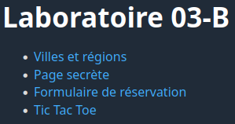

Nous allons utiliser un tableau associatif pour générer ce menu!

Ajoutez d'abord le code suivant au début du fichier `index.php`:

```php
$pages = [
    'Villes et régions' => 'pages/villes_regions.php',
    'Page secrète' => 'pages/page_secrete.php',
    'Formulaire de réservation' => 'pages/reservation.php',
    'Tic Tac Toe' => 'pages/tic_tac_toe.php',
];
```

Ce code déclare une variable `$pages`et l'initialise avec un **tableau associatif** dont les clés sont les titres des page et les valeurs sont leurs emplacements relatifs.

Ajoutez maintenant le code suivant entre les balises `<nav>` et `</nav>`:

```php
<ul>
    <?php
    foreach ($pages as $titre => $url) {
        echo "<li><a href='{$url}'>{$titre}</a></li>";
    }
    ?>
</ul>
```

## 1 - Villes et régions

### Étape 1.1

Dans le fichier `pages/villes_regions.php`, créez un tableau associatif contenant les données ci-dessous. Il s'agit d'un tableau qui associe des villes du Québec à leurs régions administratives.

| Clé              | Valeur           |
|------------------|------------------|
| Montréal         | Montréal         |
| Québec           | Québec           |
| Laval            | Laval            |
| Gatineau         | Outaouais        |
| Longueuil        | Montérégie       |
| Sherbrooke       | Estrie           |
| Magog            | Estrie           |
| Coaticook        | Estrie           |
| Trois-Rivières   | Mauricie         |
| Drummondville    | Centre-du-Québec |

Faites ensuite en sorte que la page reçoive un paramètre `ville` passé dans l'URL, et affiche la région administrative qui correspond à cette ville. Si le paramètre `ville` est absent, il faut afficher `Paramètre "ville" manquant.`. Si la ville est présente mais qu'elle ne se trouve pas dans le tableau, il faut afficher `Ville inconnue.`.

Voici le résultat attendu pour la valeur `Sherbrooke`:

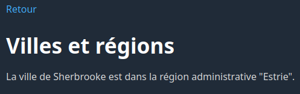

### Étape 1.2

Modifiez votre page afin d'utiliser un formulaire pour indiquer le nom de la ville dont on veut connaître la région administrative. **L'information saisie ne doit pas être visible dans l'URL.** Vous devez respecter la logique décrite ci-dessous.

Si le champ `ville` n'a pas été reçu, il faut afficher le formulaire:

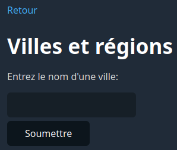

Si le champ `ville` a été reçu mais que cette ville ne se trouve pas dans le tableau, il faut afficher ceci:

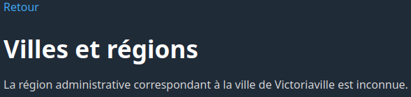

Autrement, on affiche le résultat:


### Étape 1.3

Ajoutez un lien `Entrer une autre ville` qui ramène l'utilisateur au formulaire et qui s'affiche uniquement si le formulaire n'est pas présentement affiché.

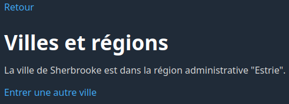

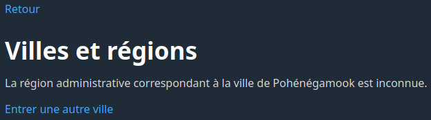

## 2 - Page secrète

### Étape 2.1

Dans le fichier `pages/page_secrete.php`, faites en sorte que la page "Page secrète" demande un mot de passe pour accéder à son contenu. Le mot de passe doit être « **abricot** ». Si le mot de passe saisi est le bon, on affiche « **Bravo! Vous avez trouvé le mot de passe!** ». Sinon, on affiche « **Mot de passe incorrect** ».


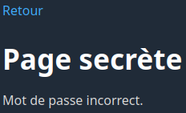

### Étape 2.2

Modifiez la page en ajoutant une variable de session pour faire en sorte que la connexion soit **persistante**, c'est-à-dire qu'une fois qu'on est authentifié, on reste authentifié même si on quitte la page et qu'on y revient.

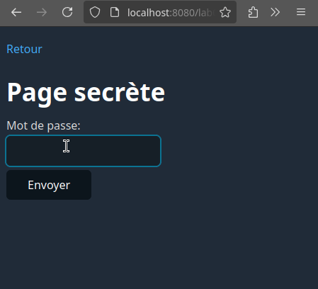

### Étape 2.3

Modifiez la page en ajoutant un lien « Se déconnecter » qui déconnecte l'utilisateur, et ce de manière persistente.

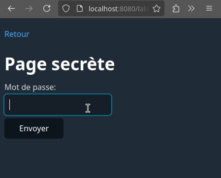

### Étape 2.4

Modifiez la page afin d'exiger **un nom d'utilisateur et un mot de passe** plutôt que seulement un mot de passe. Pour ce faire, créez d'abord un tableau qui associe des noms d'utilisateur à des mots passe. Votre tableau doint contenir les utilisateurs suivants:

| Nom d'utilisateur | Mot de passe  |
|------------------ |---------------|
| jaja72            | lapin         |
| petitefleur145    | chat          |
| bob               | poisson       |

Une fois que l'utilisateur est connecté, la page doit le saluer avec son nom d'utilisateur.

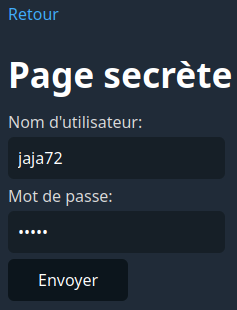


Si le nom d'utilisateur ou le mot de passe est incorrect, il faut afficher un message d'erreur, puis ré-afficher le formulaire.

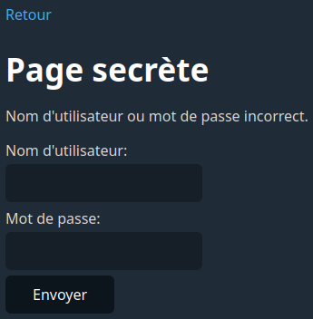

### Étape 2.5

Modifiez votre code de façon à ce que chaque nom d'utilisateur soit aussi associé à un **vrai nom**. Voici les vrais noms correspondant aux trois utilisateurs:

| Nom d'utilisateur | Vrai nom           |
|------------------ |--------------------|
| jaja72            | Jacynthe Laplante  |
| petitefleur145    | Rose Lafleur       |
| bob               | Bob L'éponge       |

Une fois l'utilisateur connecté, il faut le saluer avec son vrai nom plutôt qu'avec son nom d'utilisateur.


Les noms d'utilisateur et les mots de passe, eux, ne changent pas. L'utilisatrice Jacynthe Laplante doit toujours taper le nom d'utilisateur `jaja72` et le mot de passe `lapin` pour se connecter.

> **Attention:** vous ne devez ajouter aucune nouvelle structure conditionnelle!

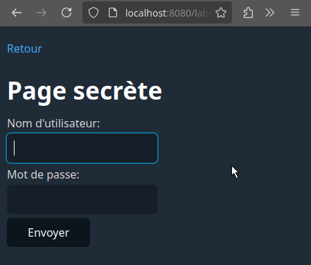

## 3 - Formulaire de réservation

Dans le fichier `pages/reservation.php`, vous trouverez un formulaire de réservation d'une chambre d'hôtel. Modifiez le fichier afin d'afficher les informations suivantes provenant du formulaire une fois la réservation transmise:

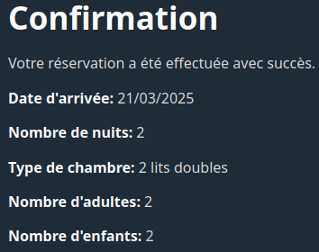

Vérifiez d'abord la présence et la validité des données reçues (*Never Trust User Input!*). N'oubliez pas également de vous prémunir contre l'injection de balises HTML avant d'afficher les informations sur la page!

## 4 - Tic Tac Toe

À l'aide d'un tableau à deux dimensions et des variables de session, reproduisez le jeu de Tic Tac Toe ci-dessous:

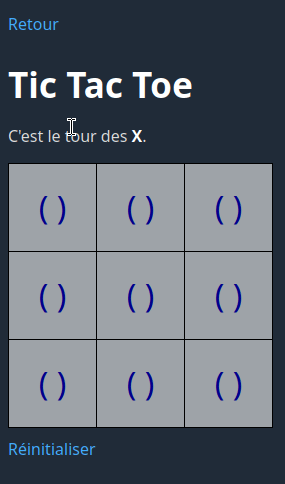

Bonne chance!
